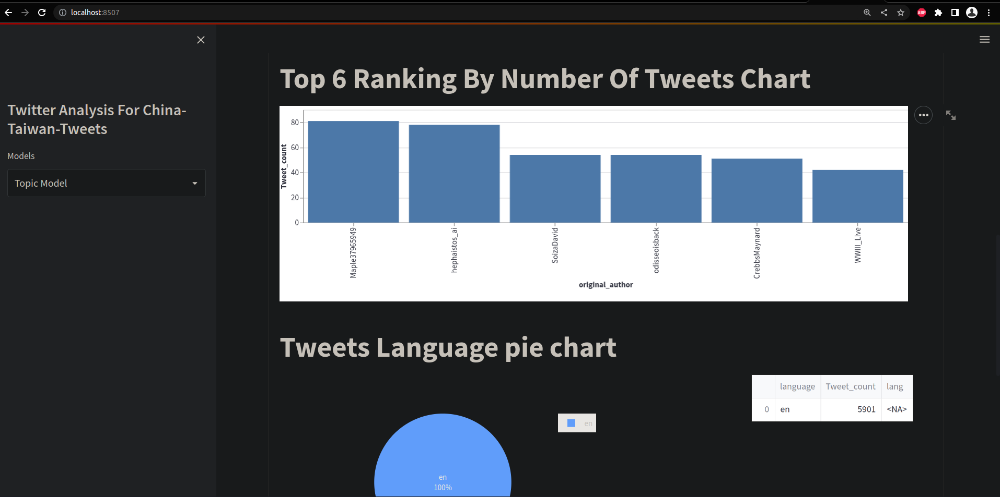

# Twitter-Data-Analysis

###### Objectives
The purpose of 10 Academy’s pre-assessment training was to provide Twitter data based challenges where potential trainees are required to complete Machine Learning Engineering tasks. Through these challenges 10 Academy selects capable candidates for its three-months long intensive training. The challenges comprise daily tasks that potential trainees have to submit before a deadline.

###### Workflow Framework
The CRISP-DM was used on this project which follows the patterns shown below. The process is iterative and starts at the Business Understanding phase.

**1.Business Understanding:-** Identifying business objectives, resources and success criteria.
Data Understanding:-  Collect data or use available data; describe data, i.e examine the data format, number of rows and columns field identities and available features; Explore data by visualizations to make sure the data could verify the business question; Verify data quality i.e check for missing values.

**2.Data Preparation:-** This phase will help prepare the data for the modeling phase. It includes, data selection, data cleaning, feature engineering, data integration and data formatting.

**3.Modeling:-** This phase will develop our machine learning model and do sentiment analysis to answer the business question. It includes model selection, i.e select machine learning algorithms and explain why we chose a certain algorithm; test design, i.e splitting the data into train set and test set; model development, model assessment i.e measure model success and choose the best model.

**4.Evaluation:-**  evaluate the model concerning the business indicator and what to do next. It include evaluating the trained model with the test set acquired in designing tests; review our work process to check if anything is missing, if all phases has executed as required, summarize our findings and correct anything if necessary; determining next steps i.e decide if the model is ready for deployment, if it needs more iteration or even start a new project.

# Sentiment Analysis and Topic Modeling on Twitter Data
###### Introduction
What are twitter users concerned about and their reaction toward certain issues? There is a huge amount of data that can be collected from twitter to try and solve these questions. Even one single tweet is full of information.Twitter allows its data to be accessible through its access point which makes it easier for academic research.
###### How was the Data collected?
There were two data that was pre-downloaded by the10 Academy team.  They were provided to us as raw JSON formats. They collected based on keywords like [‘chinaus’, ‘chinaTaiwan’,  ‘chinaTaiwancrisis’, ‘taiwan’, ‘XiJinping’, ‘USCHINA’, ‘pelosi’, ‘TaiwanStraitsCrisis’, ‘WWIII’,  ‘pelosivisittotaiwan’]. The first one was 149 MB. The second one was 128 MB collected based on the same keywords plus country specific geocodes included. E.g -28.479,26.128,400km for South Africa. 

###### Extracting Tweets From The Raw Data
First we have to import important libraries such as json, textblob, pandas and re. The raw data was loaded using pandas to extract the information into a dataframe. To do that we used a function that accepts the raw files to open and read them into a list. 

Then we created a class that parses the tweets from the read JSON into a pandas dataframe. The class has methods that allow us to do that. Some of the methods are shown below. They return a list.

We then create needed columns for the parsed to form the dataframe. Then lists returned from the methods are then made into a Zip object. This will allow each first item in each passed iterator to be paired together and each second item in each passed iterator to be paired together, and so on. 
After setting the zip object, the columns are made into a dataframe. Then the dataframe is saved into a CSV file. 

###### Data Cleaning and Preparation
After processing the data into a CSV, we have to clean it to make it Analysis and Modeling ready. For that I used a module for cleaning. The cleaning module has methods to check for duplicates, unwanted columns and clean the tweets from special characters.  

After cleaning the data it will look something similar to as shown below.

###### Exploratory Data Analysis (Basic EDA)
In this phase of the project I managed to analyze the processed data and summarize main characteristics before modeling the data. I used mainly pandas built in methods to accomplish this. The steps are shown below.

###### Sentiment Analysis
In this phase of the project I managed to determine the reaction, the feeling of the general public through the tweets by classifying them into positive, negative and neutral categories.
In doing so, It shows most of the tweets lie between neutral and positive sentiments but it also shows there are significant number of negative sentiments.

###### Topic Modeling and Clustering
In this phase of the project, I managed to find relevant  topics that were the subject of talking on the gathered data. I used an unsupervised machine learning technique called Topic Modeling to automate this task. I used an algorithm called Latent Dirichlet Allocation (LDA) which is used to find correlation in multiple documents in a corpus. The below shows my findings.

Finally I created a WorldCloud to showcase the most relevant topics. The bigger and bolder the words show the most tweeted words.

###### Dashboard and deployment
Finally the model is built into a dashboard to allow interactive visualization. It is important to showcase your findings to stakeholders  and people to get quick solutions for their questions.

###### Conclusion
From day one the experiences and challenges were rewarding but also challenging. Working on the challenges gave me a glimpse of what a Machine Learning Engineer work looks like, from having a workflow framework to deploying your funding and insights. It made me respect the profession by the amount of work it is done. I can say I’m already in love with ML. Now looking back at the road I took, the challenges I faced and seeing my works pleasing. And kudos for 10 Academy for creating this awesome learning process where I learned a significant amount of knowledge in just one week.

